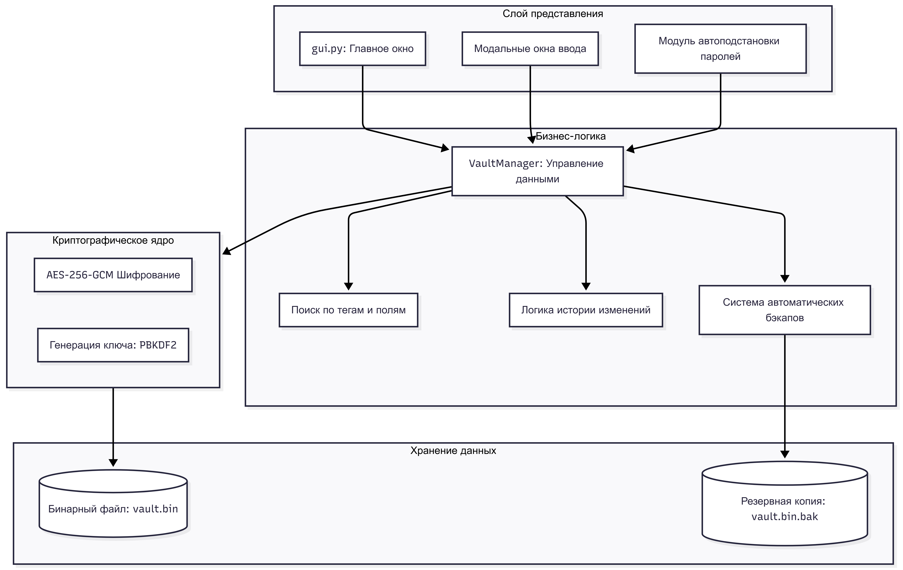
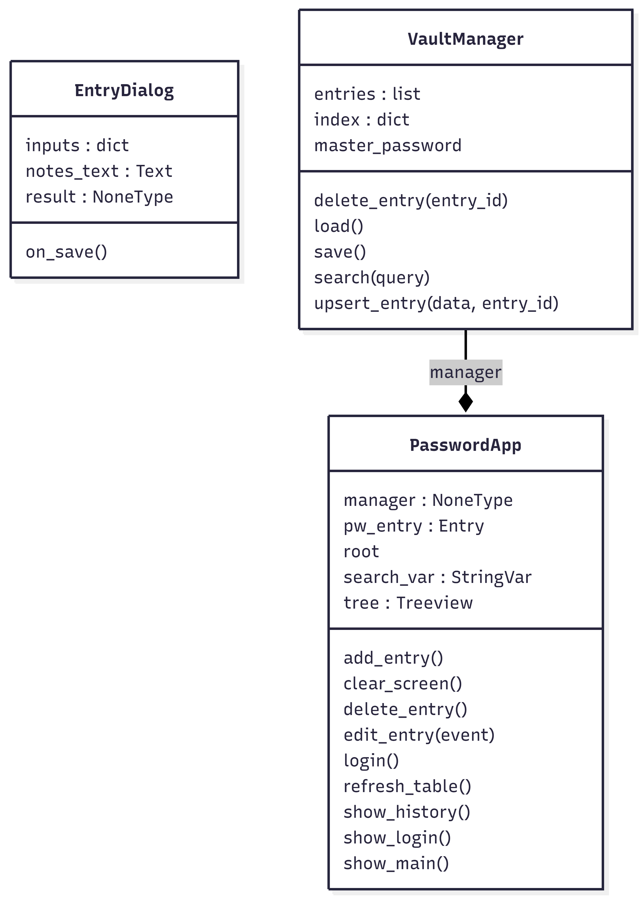

# Лабораторная работа №3
## Тема: «Исследование архитектурного решения»
**Проект:** Менеджер паролей на Python (SafePass)

---

## Часть 1. Проектирование архитектуры («To Be»)

В данном разделе представлена целевая архитектура приложения, спроектированная с учетом требований информационной безопасности и удобства конечного пользователя.

### 1. Определение типа приложения
Приложение классифицируется как **«Настольное приложение» (Desktop Application)**.

**Обоснование:** 
Для обеспечения максимальной безопасности конфиденциальных данных (паролей) требуется локальная изоляция. Настольное приложение позволяет реализовать защищенное хранилище непосредственно на устройстве пользователя, исключая риски, связанные с передачей секретов по сети и зависимостью от сторонних серверов.

### 2. Выбор стратегии развёртывания
Выбрана стратегия **нераспределенного (одноуровневого) развертывания**.

**Обоснование:**
1.  **Локальность:** Все компоненты системы (интерфейс, логика, крипто-ядро) и данные (файл базы) находятся на одном физическом узле.
2.  **Безопасность:** Отсутствие сетевых коммуникаций между уровнями приложения сводит к минимуму поверхность атаки и исключает возможность перехвата трафика (MITM).
3.  **Автономность:** Приложение функционирует без необходимости подключения к интернету, обеспечивая доступ к данным в любой момент.

### 3. Обоснование выбора технологии
*   **Язык программирования:** Python 3 (высокая скорость разработки, кроссплатформенность, развитая экосистема библиотек безопасности).
*   **Слой представления (GUI):** Tkinter (легковесность, встроенность в стандартную библиотеку, отсутствие тяжелых внешних зависимостей).
*   **Криптографическое ядро:** Библиотека PyCryptodome (поддержка алгоритмов AES-256-GCM и PBKDF2-SHA512, реализованных на C для высокой производительности).
*   **Хранение данных:** Бинарный файл-контейнер с внутренней структурой JSON (сочетание гибкости структуры и компактности).

### 4. Показатели качества (Quality Attributes)
1.  **Безопасность:** Применение режима AES-GCM обеспечивает аутентифицированное шифрование, что гарантирует конфиденциальность и целостность базы (защита от изменения файлов).
2.  **Надежность:** Предотвращение потери данных за счет автоматического создания резервных копий и хранения истории изменений каждой записи.
3.  **Производительность:** Мгновенный отклик интерфейса при поиске благодаря индексации данных в оперативной памяти после дешифрования.
4.  **Удобство (Usability):** Модальные окна и полнотекстовый поиск по всем полям (теги, URL, заметки).

### 5. Сквозная функциональность (Cross-cutting Concerns)
*   **Шифрование/Дешифрование:** Изолированный слой, обеспечивающий прозрачную работу с данными.
*   **Аутентификация:** Проверка мастер-пароля на основе валидности MAC-тега шифра AES-GCM.
*   **Валидация:** Строгий контроль корректности входных данных на этапе создания или редактирования записей.

### 6. Структурная схема приложения (To Be)

## Часть 2. Анализ архитектуры («As Is»)

### Текущая реализация системы
На данном этапе система представляет собой модульное монолитное приложение, распределенное по трем основным модулям:

1.  **crypto_core.py** — Инструментарий для PBKDF2 и AES-GCM шифрования. Содержит основные криптографические примитивы, обеспечивающие безопасность данных.
2.  **manager.py** — Координация данных, реализация CRUD-операций, полнотекстового поиска и механизмов истории. Является связующим звеном между интерфейсом и хранилищем.
3.  **gui.py** — Интерфейс взаимодействия, реализованный на библиотеке Tkinter. Управляет жизненным циклом окон и отображением дешифрованных данных.

### Диаграмма классов текущей реализации
*(Примечание: Сюда необходимо вставить скриншот диаграммы, сгенерированной через pyreverse или нарисованной на основе текущего кода)*

### Выявленные проблемы и технический долг
*   **Синхронное выполнение:** Операции KDF (генерация ключа) и операции записи на диск блокируют основной поток GUI. Это вызывает кратковременное зависание интерфейса (1-2 секунды) при входе в приложение.
*   **Жесткая связанность:** Высокая зависимость между GUI и логикой менеджера. Класс интерфейса напрямую манипулирует объектами менеджера, что затрудняет раздельное тестирование слоев.
*   **Отсутствие бэкапов:** Сохранение данных происходит путем перезаписи основного файла. При сбое питания в момент записи файл `vault.bin` может быть поврежден, что приведет к полной потере паролей.
*   **Статичные пути:** Путь к базе данных зашит в коде. Отсутствует возможность для пользователя выбрать файл базы или создать несколько разных профилей.

---

## Часть 3. Сравнение и рефакторинг

### 1. Сравнение архитектур «As Is» и «To Be»

| Критерий | «As Is» (Текущая) | «To Be» (Целевая) |
| :--- | :--- | :--- |
| **UX / Отзывчивость** | Синхронная (лаги при операциях) | Асинхронная (Background Threading) |
| **Резервирование** | Отсутствует | Автоматические .bak файлы |
| **Автоподстановка** | Ручное копирование из ячеек | Интеграция с буфером обмена / системными API |
| **Управление хранением** | Прямая работа с файлом JSON | Слой абстракции (IStorage) |
| **Безопасность памяти** | Обычные строковые переменные | Принудительная очистка секретов после использования |

### 2. Отличия и их причины
*   **Отсутствие асинхронности:** Причина — упрощение архитектуры в рамках первой итерации разработки (MVP). Основной целью была проверка корректности работы криптографического ядра.
*   **Отсутствие системы бэкапов:** Причина — фокус на реализации функционала истории изменений внутри самой структуры данных, резервное копирование на уровне файлов было отложено на следующие этапы.

### 3. Пути улучшения архитектуры (План рефакторинга)

1.  **Внедрение многопоточности (Threading):**
    Использование модуля `threading` для выноса функций генерации ключа и записи файла в фоновые потоки. Это позволит интерфейсу оставаться «живым» во время выполнения тяжелых вычислений.
2.  **Механизм резервного копирования:**
    Модификация процесса сохранения: перед началом записи новой версии файла `vault.bin`, текущая версия должна автоматически переименовываться в `vault.bin.bak`.
3.  **Модуль автоподстановки (Auto-fill):**
    Реализация функций взаимодействия с ОС для автоматического ввода пароля в активное окно или использование защищенного буфера обмена с таймером автоматической очистки через 30 секунд.
4.  **Усиление защиты данных в памяти:**
    Использование специализированных структур (например, байтовых массивов), которые поддерживают принудительное затирание (zeroing) в памяти сразу после того, как данные были выведены на экран или использованы для входа.

---

## Вывод

В ходе лабораторной работы был проведен комплексный анализ архитектуры настольного менеджера паролей. 

Текущая реализация (**As Is**) является классической **нераспределенной** системой, обеспечивающей базовый уровень функциональности и высокую степень защиты данных за счет AES-256-GCM. Спроектированная целевая архитектура (**To Be**) намечает конкретные шаги по устранению технического долга, повышению отказоустойчивости системы и улучшению пользовательского опыта. Реализация намеченного плана рефакторинга позволит превратить прототип в надежное и удобное конечное приложение.