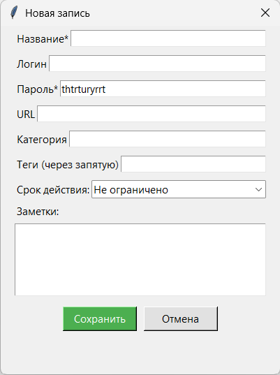
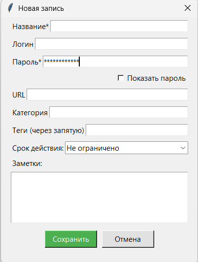
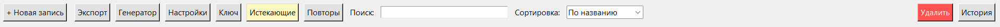
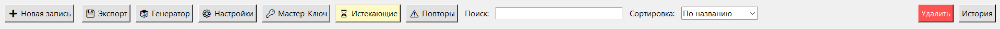

# Лабораторная работа №6: Улучшение UX

**Тема:** Улучшение пользовательского интерфейса и опыта использования (UX) разрабатываемого приложения (Менеджер паролей).

## 1. Оценка разрабатываемого ПО по атрибутам ISO/IEC 25010 (Usability)

Проведена оценка текущего состояния интерфейса приложения "ShadowPass" по шести атрибутам юзабилити:

1. **Распознаваемость соответствия (Appropriateness recognizability):** 4/5. Приложение выглядит как менеджер паролей, однако верхняя панель инструментов перегружена однотипными текстовыми кнопками без визуальных акцентов, что замедляет поиск нужной функции.
2. **Обучаемость (Learnability):** 5/5. Интерфейс табличный, интуитивно понятный. Использование стандартных горячих клавиш (Ctrl+C, Ctrl+V) реализовано корректно.
3. **Используемость / Операбельность (Operability):** 4/5. Отличная поддержка горячих клавиш и глобальных хуков. Однако при создании пароля нет возможности быстро скрыть/показать пароль (отсутствует переключатель видимости).
4. **Защита от ошибок пользователя (User error protection):** 3/5. **Критический недочет:** в диалоге создания новой записи (класс `EntryDialog`) пароль вводится открытым текстом. Возможна утечка данных при посторонних взглядах (shoulder surfing).
5. **Эстетика GUI (User interface aesthetics):** 4/5. Реализована темная и светлая темы, интерфейс аккуратный, но выглядит слишком строго из-за отсутствия пиктограмм (иконок) на элементах управления.
6. **Доступность (Accessibility):** 4/5. Контрастность тем соблюдена, есть навигация с помощью клавиатуры (Tab), но нет всплывающих подсказок (tooltips) для неочевидных кнопок.

## 2. Выбор путей улучшения UX и обоснование

На основе анализа выбраны два основных направления улучшения UX:

*   **Улучшение 1: Защита ввода пароля в `EntryDialog` (Защита от ошибок).** 
    *   *Обоснование:* Ввод конфиденциальных данных открытым текстом недопустим в ПО такого класса. Необходимо скрыть символы пароля звездочками по умолчанию и добавить чекбокс "Показать пароль".
*   **Улучшение 2: Визуальная иерархия панели управления (Эстетика и Распознаваемость).** 
    *   *Обоснование:* Сплошной текст кнопок ("Новая запись", "Экспорт", "Генератор" и т.д.) заставляет пользователя каждый раз читать их заново (повышенная когнитивная нагрузка). Добавление логичных иконок (на уровне поверхности UX) позволит мозгу пользователя распознавать нужную кнопку за доли секунды.

## 3. Проведение улучшений (Код)

### Улучшение 1: Скрытие пароля в диалоге записи
**Файл:** `gui.py`, класс `EntryDialog`, метод `__init__`

**ДО (Было):**
```python
        self.inputs = {}
        for field, label in fields:
            frame = tk.Frame(self)
            frame.pack(fill=tk.X, padx=20, pady=5)
            tk.Label(frame, text=label).pack(side=tk.LEFT)
            ent = tk.Entry(frame) # <--- Пароль вводится открытым текстом!
            if initial_data:
                val = initial_data.get(field, "")
                ent.insert(0, ",".join(val) if field == "tags" else val)
            ent.pack(side=tk.RIGHT, expand=True, fill=tk.X)
            self.inputs[field] = ent
```
**ПОСЛЕ (Стало):**
```python
self.inputs = {}
        self.show_password_var = tk.BooleanVar(value=False) # Переменная для чекбокса

        for field, label in fields:
            frame = tk.Frame(self)
            frame.pack(fill=tk.X, padx=20, pady=5)
            tk.Label(frame, text=label).pack(side=tk.LEFT)
            
            # Если поле - пароль, скрываем его по умолчанию
            if field == "password":
                ent = tk.Entry(frame, show="*")
            else:
                ent = tk.Entry(frame)
                
            if initial_data:
                val = initial_data.get(field, "")
                ent.insert(0, ",".join(val) if field == "tags" else val)
            ent.pack(side=tk.RIGHT, expand=True, fill=tk.X)
            self.inputs[field] = ent
            
            # Добавляем чекбокс прямо под полем пароля
            if field == "password":
                cb_frame = tk.Frame(self)
                cb_frame.pack(fill=tk.X, padx=20)
                tk.Checkbutton(cb_frame, text="Показать пароль", 
                               variable=self.show_password_var, 
                               command=self.toggle_password).pack(side=tk.RIGHT)

    # Новый метод в классе EntryDialog:
    def toggle_password(self):
        char = "" if self.show_password_var.get() else "*"
        self.inputs["password"].config(show=char)
```
### Улучшение 2: Визуальные якоря (иконки) в главном меню
**Файл:** `gui.py`, класс `PasswordApp`, метод `show_main`
**ДО (Было):**
```python
tk.Button(top_bar, text="+ Новая запись", command=self.add_entry).pack(side=tk.LEFT, padx=10)
        tk.Button(top_bar, text="Экспорт", command=self.export_vault).pack(side=tk.LEFT, padx=5)
        tk.Button(top_bar, text="Генератор", command=self.open_generator, bg="#E3F2FD").pack(side=tk.LEFT, padx=5)
        tk.Button(top_bar, text="Настройки", command=self.open_settings).pack(side=tk.LEFT, padx=5)
        tk.Button(top_bar, text="Ключ", command=self.change_master_password).pack(side=tk.LEFT, padx=5)
        tk.Button(top_bar, text="Истекающие", command=self.show_expiring_soon, bg="#FFF9C4").pack(side=tk.LEFT, padx=5)
        tk.Button(top_bar, text="Повторы", command=self.show_reused_passwords, bg="#E8F5E9").pack(side=tk.LEFT, padx=5)
```
**ПОСЛЕ (Стало):**
```python
# Добавлены пиктограммы для интуитивного распознавания (Level: Surface)
        tk.Button(top_bar, text="➕ Новая запись", command=self.add_entry).pack(side=tk.LEFT, padx=10)
        tk.Button(top_bar, text="💾 Экспорт", command=self.export_vault).pack(side=tk.LEFT, padx=5)
        tk.Button(top_bar, text="🎲 Генератор", command=self.open_generator, bg="#E3F2FD").pack(side=tk.LEFT, padx=5)
        tk.Button(top_bar, text="⚙️ Настройки", command=self.open_settings).pack(side=tk.LEFT, padx=5)
        tk.Button(top_bar, text="🔑 Мастер-Ключ", command=self.change_master_password).pack(side=tk.LEFT, padx=5)
        tk.Button(top_bar, text="⏳ Истекающие", command=self.show_expiring_soon, bg="#FFF9C4").pack(side=tk.LEFT, padx=5)
        tk.Button(top_bar, text="⚠️ Повторы", command=self.show_reused_passwords, bg="#E8F5E9").pack(side=tk.LEFT, padx=5)
```
## 4. Результаты (До vs После)

### Сравнение 1: Диалог создания записи
**Проблема ДО:** Пароль видно всем окружающим.  
**Решение ПОСЛЕ:** Пароль скрыт, добавлен чекбокс для безопасного просмотра.

| Окно создания (ДО) | Окно создания (ПОСЛЕ) |
|---|---|
| <br> *Пароль отображается открытым текстом* | <br> *Пароль скрыт звездочками, добавлен чекбокс "Показать пароль"* |

### Сравнение 2: Главная панель инструментов
**Проблема ДО:** Однообразный текст сливается, пользователю приходится вчитываться.  
**Решение ПОСЛЕ:** Наличие визуальных иконок мгновенно дает понять назначение кнопок (шестеренка = настройки, кубики/кости = генератор случайного пароля).

| Верхнее меню (ДО) | Верхнее меню (ПОСЛЕ) |
|---|---|
| <br> *Скучный текстовый интерфейс, высокая когнитивная нагрузка* | <br> *Интерфейс с визуальными якорями для быстрой навигации* |

## Вывод
За счет внедрения двух небольших, но важных правок на "Уровне поверхности" (Surface Level) и "Уровне компоновки" (Skeleton Level) согласно модели элементов UX, удалось значительно повысить безопасность использования приложения в общественных местах и ускорить взаимодействие пользователя с основным функционалом. Это полностью удовлетворяет критериям ISO/IEC 25010 в части защиты от ошибок и эстетики.
    


